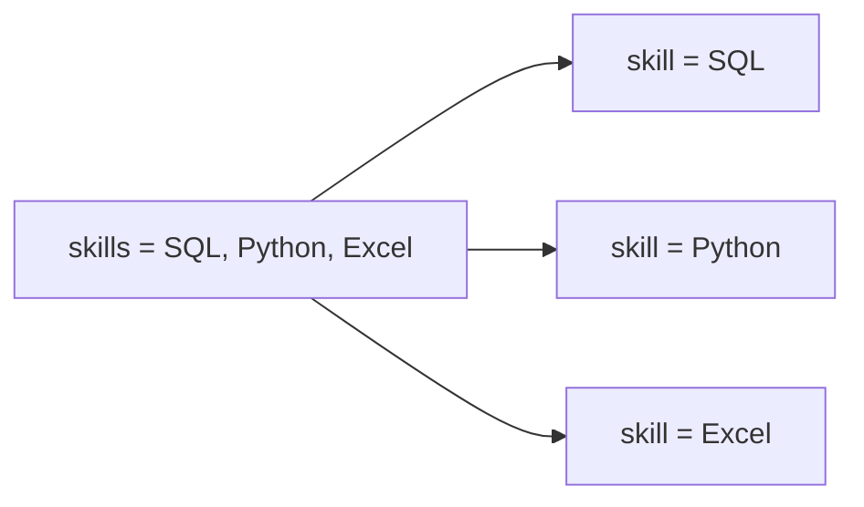
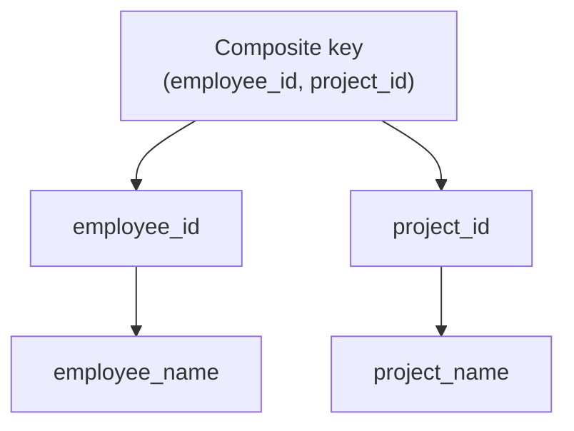
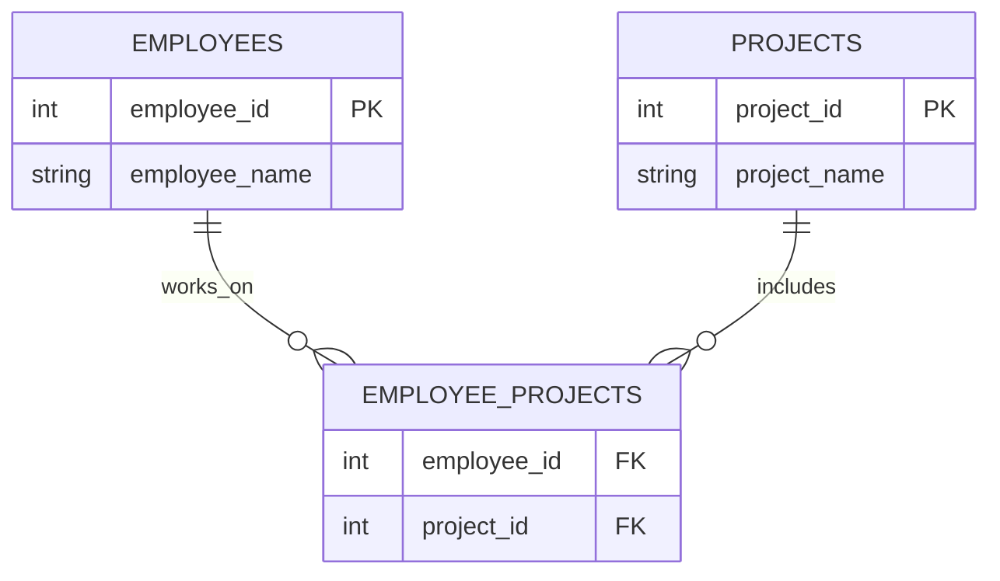
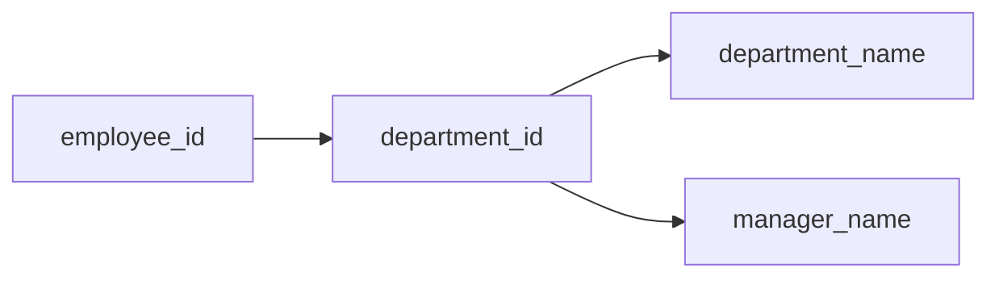
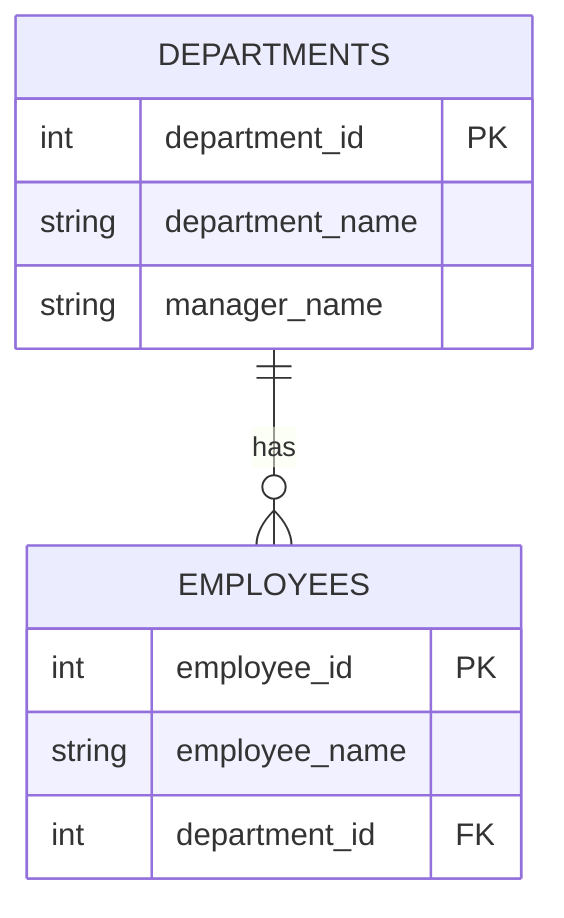
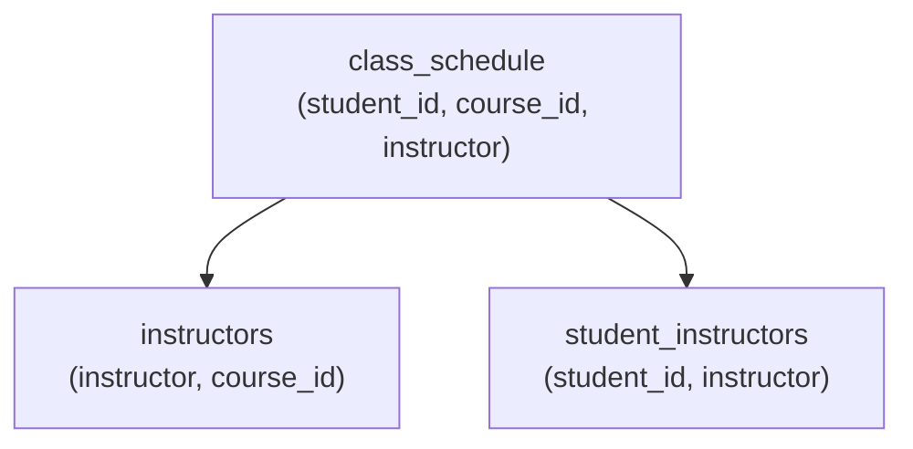
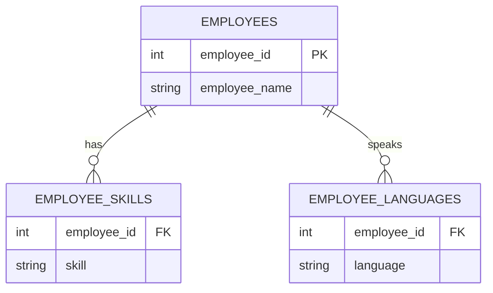
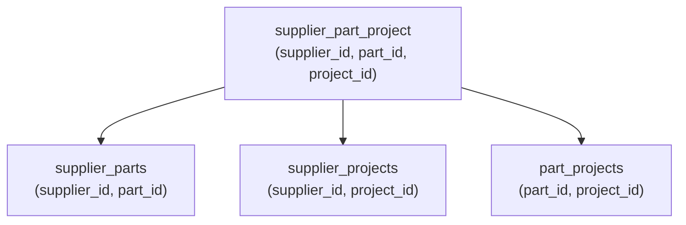

# Day 3 Lecture: Transactions, ACID, and Database Design

> Theme: a database is trustworthy when related changes succeed together, invalid data is rejected, concurrent users do not corrupt each other, and committed data survives failure.

## Learning Goals

By the end of Day 3, students should be able to:

- Explain why transactions are needed in real systems.
- Describe the four ACID properties with practical examples.
- Use `START TRANSACTION`, `COMMIT`, and `ROLLBACK` in MySQL.
- Identify common isolation problems such as dirty reads, non-repeatable reads, and phantom reads.
- Compare ER, semi-structured, and object-based data models.
- Distinguish physical, logical, and external database schemas.

---

## Exam Recap Guide

<table>
<tr>
<td><strong><span style="color:#2563eb">Blue</span></strong></td>
<td>Core definitions and concepts</td>
</tr>
<tr>
<td><strong><span style="color:#16a34a">Green</span></strong></td>
<td>Processes, workflows, and step-by-step logic</td>
</tr>
<tr>
<td><strong><span style="color:#ea580c">Orange</span></strong></td>
<td>SQL syntax, commands, formulas, and examples</td>
</tr>
<tr>
<td><strong><span style="color:#dc2626">Red</span></strong></td>
<td>Risks, mistakes, anomalies, and warnings</td>
</tr>
</table>

### Quick Topic Map

| Color | Topic | What to Recap Before Exam |
| --- | --- | --- |
| <span style="color:#2563eb">&#9679;</span> | 1. Why Transactions Matter | Review definitions, tables, examples, workflows, and key ideas. |
| <span style="color:#16a34a">&#9679;</span> | 2. ACID at a Glance | Review definitions, tables, examples, workflows, and key ideas. |
| <span style="color:#9333ea">&#9679;</span> | 3. Atomicity: All or Nothing | Review definitions, tables, examples, workflows, and key ideas. |
| <span style="color:#ea580c">&#9679;</span> | 4. Consistency: Keep the Rules True | Review definitions, tables, examples, workflows, and key ideas. |
| <span style="color:#dc2626">&#9679;</span> | 5. Isolation: Safe Concurrent Work | Review definitions, tables, examples, workflows, and key ideas. |
| <span style="color:#0891b2">&#9679;</span> | 6. Durability: Commit Means Saved | Review definitions, tables, examples, workflows, and key ideas. |
| <span style="color:#4f46e5">&#9679;</span> | 7. Practical Transaction Commands | Review definitions, tables, examples, workflows, and key ideas. |
| <span style="color:#65a30d">&#9679;</span> | 8. Data Models Covered | Review definitions, tables, examples, workflows, and key ideas. |
| <span style="color:#2563eb">&#9679;</span> | 9. Relational Model Concepts | Review definitions, tables, examples, workflows, and key ideas. |
| <span style="color:#16a34a">&#9679;</span> | 10. Normalization | Review definitions, tables, examples, workflows, and key ideas. |
| <span style="color:#9333ea">&#9679;</span> | 11. Database Schema Types | Review definitions, tables, examples, workflows, and key ideas. |
| <span style="color:#ea580c">&#9679;</span> | 12. In-Class Demo Files | Review definitions, tables, examples, workflows, and key ideas. |
| <span style="color:#dc2626">&#9679;</span> | 13. Exercises | Review definitions, tables, examples, workflows, and key ideas. |
| <span style="color:#0891b2">&#9679;</span> | 14. Review Questions | Review definitions, tables, examples, workflows, and key ideas. |
| <span style="color:#4f46e5">&#9679;</span> | Further Reading | Review definitions, tables, examples, workflows, and key ideas. |

### Last-Minute Checklist

- Read each **Key idea** line first.
- Memorize the main terms and compare similar concepts.
- Re-run or rewrite the SQL examples by hand where SQL is included.
- Use the review questions at the end as mock exam prompts.

---

## 1. Why Transactions Matter

A **transaction** is a group of database operations treated as one logical unit of work.

In an HR system, promoting an employee may require several changes:

1. Increase salary.
2. Change department or role.
3. Add leave days.

These updates should not be saved halfway. If the salary changes but the role does not, the database becomes misleading. Transactions protect the database from this kind of partial update.

```sql
START TRANSACTION;

UPDATE employees
SET salary = salary + 150000
WHERE employee_id = 1;

UPDATE employees
SET department = 'Senior IT'
WHERE employee_id = 1;

UPDATE employees
SET leave_balance = leave_balance + 2
WHERE employee_id = 1;

COMMIT;
```

If something goes wrong before `COMMIT`, use:

```sql
ROLLBACK;
```

---

## 2. ACID at a Glance

| Property | Meaning | HR Example |
| --- | --- | --- |
| **Atomicity** | All steps succeed, or none are saved. | Salary increase and leave deduction must happen together. |
| **Consistency** | A transaction moves the database from one valid state to another. | Leave balance must not become negative. |
| **Isolation** | Concurrent transactions should not interfere incorrectly. | Two HR staff updating the same salary should not see unsafe intermediate data. |
| **Durability** | Once committed, data remains saved after crash or restart. | A committed salary update still exists after reconnecting to MySQL. |

---

## 3. Atomicity: All or Nothing

**Atomicity** means a transaction is indivisible. The database should not keep only part of the work.

### Successful Transaction

```sql
START TRANSACTION;

UPDATE employees
SET salary = salary + 50000
WHERE employee_id = 1;

UPDATE employees
SET leave_balance = leave_balance - 2
WHERE employee_id = 1;

COMMIT;
```

Both changes are saved.

### Failed Transaction

```sql
START TRANSACTION;

UPDATE employees
SET salary = salary + 50000
WHERE employee_id = 2;

-- Mistake: target employee does not exist.
UPDATE employees
SET leave_balance = leave_balance - 100
WHERE employee_id = 999;

ROLLBACK;
```

The salary change is undone because the full unit of work did not complete correctly.

**Key idea:** atomicity prevents half-finished business actions.

---

## 4. Consistency: Keep the Rules True

**Consistency** means a transaction must obey database rules and business rules.

Examples of rules:

- `employee_id` must be unique.
- `employee_name` must not be null.
- `salary` should be a valid numeric amount.
- `leave_balance` should not become negative.

### Valid Leave Deduction

```sql
START TRANSACTION;

UPDATE employees
SET leave_balance = leave_balance - 3
WHERE employee_id = 3
  AND leave_balance >= 3;

COMMIT;
```

The condition `leave_balance >= 3` protects the business rule.

### Invalid Leave Deduction

```sql
START TRANSACTION;

UPDATE employees
SET leave_balance = leave_balance - 20
WHERE employee_id = 4
  AND leave_balance >= 20;

COMMIT;
```

If the employee does not have enough leave, no row should be updated.

**Key idea:** consistency is not only about SQL syntax. It is about protecting the meaning of the data.

---

## 5. Isolation: Safe Concurrent Work

**Isolation** controls what happens when multiple transactions run at the same time.

In real systems, many users may read and update the database together. Isolation prevents one user from seeing another user's unfinished or unsafe work.

### Common Isolation Levels

| Isolation Level | Protection | Trade-off |
| --- | --- | --- |
| **Serializable** | Strongest. Transactions behave as if they ran one by one. | Safest, but can reduce concurrency. |
| **Repeatable Read** | Re-reading the same row returns the same result within a transaction. | Stronger consistency, may still vary by database for range queries. |
| **Read Committed** | Only committed data is visible. | Common default; allows some changes between repeated reads. |
| **Read Uncommitted** | May read uncommitted data. | Weakest; rarely recommended. |

### Isolation Problems

| Problem | What Happens |
| --- | --- |
| **Dirty read** | A transaction reads uncommitted data from another transaction. |
| **Non-repeatable read** | The same row is read twice, but another committed update changes the result. |
| **Phantom read** | A repeated range query returns a different set of rows because another transaction inserted or deleted matching rows. |

### Two-Session Demo

Use two MySQL windows.

**Session 1**

```sql
USE hr_demo;
SET SESSION TRANSACTION ISOLATION LEVEL READ COMMITTED;
START TRANSACTION;

UPDATE employees
SET salary = salary + 100000
WHERE employee_id = 5;

SELECT * FROM employees WHERE employee_id = 5;

-- Do not commit yet.
```

**Session 2**

```sql
USE hr_demo;
SET SESSION TRANSACTION ISOLATION LEVEL READ COMMITTED;

SELECT * FROM employees WHERE employee_id = 5;
```

Expected result: Session 2 should still see the old committed salary, not the uncommitted change from Session 1.

Now return to Session 1:

```sql
COMMIT;
```

Then run the select query again in Session 2. The committed salary should now be visible.

**Key idea:** isolation controls visibility while work is still in progress.

---

## 6. Durability: Commit Means Saved

**Durability** means that once a transaction commits, the database must preserve the result even if the application closes, the connection drops, or the server restarts.

```sql
START TRANSACTION;

UPDATE employees
SET salary = 950000
WHERE employee_id = 2;

COMMIT;
```

Manual durability check:

1. Run the committed update.
2. Disconnect from MySQL.
3. Reconnect.
4. Run:

```sql
SELECT * FROM employees WHERE employee_id = 2;
```

If the salary is still `950000`, durability is confirmed.

Databases usually implement durability using:

- Write-ahead logging (WAL) or redo logs.
- Checkpoints.
- Careful disk write ordering.
- Crash recovery during restart.

**Key idea:** durability turns a successful commit into a permanent database fact.

---

## 7. Practical Transaction Commands

| Command | Purpose |
| --- | --- |
| `START TRANSACTION;` | Begins a transaction. |
| `COMMIT;` | Saves all changes made in the transaction. |
| `ROLLBACK;` | Cancels all uncommitted changes. |
| `SET SESSION TRANSACTION ISOLATION LEVEL ...;` | Sets isolation behavior for the current session. |

### Basic Pattern

```sql
START TRANSACTION;

-- Step 1
-- Step 2
-- Step 3

COMMIT;
```

### Error Pattern

```sql
START TRANSACTION;

-- Step 1 succeeds.
-- Step 2 fails or violates the intended logic.

ROLLBACK;
```

---

## 8. Data Models Covered

### Entity-Relationship Model

The **ER model** is used to design a database before implementation.

| Concept | Meaning | Example |
| --- | --- | --- |
| Entity | A real-world object or concept. | `Employee`, `Department`, `Payroll` |
| Attribute | A property of an entity. | `employee_name`, `salary`, `leave_balance` |
| Relationship | A connection between entities. | Employee belongs to Department |
| Cardinality | The number relationship between entities. | One department has many employees |

Best for:

- Conceptual database design.
- Normalization.
- Planning relational tables and keys.

### Semi-Structured Data Model

Semi-structured data supports flexible records where fields may vary.

Common formats:

- JSON
- XML
- BSON

Example:

```json
{
  "employee_id": 1,
  "employee_name": "Aung Aung",
  "skills": ["SQL", "Python"],
  "emergency_contact": {
    "name": "Su Su",
    "phone": "09-123456789"
  }
}
```

Best for:

- Web APIs.
- Document databases.
- Data that changes shape frequently.

### Object-Based Data Model

The **object-based model** represents data as objects, similar to object-oriented programming.

An object may contain:

- Attributes.
- Methods.
- Inheritance.
- Encapsulated behavior.

Example:

```text
Employee
  - employee_id
  - employee_name
  - salary
  - calculate_bonus()
```

Best for:

- Object databases.
- Application models.
- ORMs that map program objects to database tables.

---

## 9. Relational Model Concepts

The **relational model** is the foundation of most SQL databases. It stores data in **relations**, which we usually call **tables**.

Think of a relational database as a collection of clean, connected tables:

- Each table stores one main subject.
- Each row stores one record about that subject.
- Each column stores one fact about the record.
- Keys connect related tables together.

> Classroom shortcut: **table = relation**, **row = tuple**, **column = attribute**.

### Core Terms

| Concept | Simple Meaning | HR Example |
| --- | --- | --- |
| **Relation** | A table in the database. | `employees` |
| **Tuple** | One row or one complete record. | One employee record |
| **Attribute** | A column or property of the table. | `employee_name`, `salary` |
| **Domain** | The allowed values for an attribute. | `salary` must be a decimal number |
| **Degree** | Number of columns in a relation. | `employees` has 5 columns |
| **Cardinality** | Number of rows in a relation. | `employees` has 6 rows after sample insert |

### Mini Table View

```text
Relation: employees

+-------------+---------------+------------+-----------+---------------+
| employee_id | employee_name | department | salary    | leave_balance |
+-------------+---------------+------------+-----------+---------------+
| 1           | Aung Aung     | IT         | 800000.00 | 10            |
| 2           | Su Su         | HR         | 600000.00 | 8             |
+-------------+---------------+------------+-----------+---------------+
```

In this example:

- The relation is `employees`.
- The attributes are `employee_id`, `employee_name`, `department`, `salary`, and `leave_balance`.
- Each row is a tuple.
- The degree is `5` because the table has five columns.
- The cardinality is the number of rows currently stored in the table.

### Relation Schema

```text
employees(employee_id, employee_name, department, salary, leave_balance)
```

This compact format describes the structure of the table without showing the actual data.

### Domains

A **domain** defines what kind of value an attribute can store.

| Attribute | Possible Domain |
| --- | --- |
| `employee_id` | Positive integer values |
| `employee_name` | Text values, not empty |
| `department` | Text values such as `IT`, `HR`, `Finance` |
| `salary` | Decimal numbers with two digits after the point |
| `leave_balance` | Integer values greater than or equal to `0` |

Good domains prevent meaningless data, such as a negative salary or text inside a numeric column.

### Keys

Keys identify records and connect tables.

| Key Type | Meaning | Example |
| --- | --- | --- |
| **Super key** | Any attribute or set of attributes that can uniquely identify a row. It may include extra columns. | `employee_id` or `(employee_id, employee_name)` |
| **Primary key** | Uniquely identifies each row in a table. | `employee_id` in `employees` |
| **Candidate key** | A minimal super key with no unnecessary extra columns. | `employee_id` or a unique employee email |
| **Foreign key** | Connects one table to another table. | `department_id` in `employees` referencing `departments` |
| **Composite key** | A key made from more than one column. | `(employee_id, project_id)` in an assignment table |

Key hierarchy:

```text
Super key -> Candidate key -> Primary key
```

Every candidate key is a super key, but not every super key is a candidate key. A primary key is the candidate key chosen as the main identifier for the table.

Example with two related tables:

```text
departments(department_id, department_name)
employees(employee_id, employee_name, department_id, salary, leave_balance)
```

Here, `employees.department_id` can be a foreign key that points to `departments.department_id`.

### Relational Constraints

Constraints keep relational data correct.

| Constraint | Purpose | Example |
| --- | --- | --- |
| **Domain constraint** | Ensures values match the correct type or allowed range. | `salary DECIMAL(10,2)` |
| **Entity integrity** | Ensures primary keys are unique and not null. | `employee_id INT PRIMARY KEY` |
| **Referential integrity** | Ensures foreign keys point to valid rows. | An employee's `department_id` must exist in `departments` |
| **User-defined constraint** | Protects business rules. | `leave_balance >= 0` |

**Why constraints matter:** without constraints, the database may accept data that looks stored correctly but is logically wrong.

### Relational Operations

Common relational operations are the basis of SQL queries.

| Operation | Meaning | SQL Example |
| --- | --- | --- |
| **Selection** | Choose rows that match a condition. | `WHERE department = 'IT'` |
| **Projection** | Choose specific columns. | `SELECT employee_name, salary` |
| **Join** | Combine related rows from two tables. | `employees JOIN departments` |
| **Union** | Combine results from similar queries. | `SELECT ... UNION SELECT ...` |
| **Difference** | Find rows in one result but not another. | Often done with `NOT IN` or `EXCEPT` |

### Quick SQL Mapping

| Relational Idea | SQL Form |
| --- | --- |
| Relation | `CREATE TABLE employees (...)` |
| Tuple | `INSERT INTO employees VALUES (...)` |
| Attribute | `employee_name VARCHAR(100)` |
| Selection | `SELECT * FROM employees WHERE department = 'IT';` |
| Projection | `SELECT employee_name, salary FROM employees;` |
| Join | `SELECT ... FROM employees JOIN departments ...;` |

**Key idea:** the relational model gives databases a clear structure: tables store facts, keys identify and connect records, and constraints protect correctness.

### Checkpoint

Look at the `employees` table and answer:

1. What is the relation name?
2. What are two attributes?
3. What is one tuple?
4. Which column is the primary key?
5. What is the degree of the table?

---

## 10. Normalization

**Normalization** is the process of organizing database tables to reduce data redundancy and improve data correctness.

It helps eliminate undesirable design problems such as:

- **Insertion anomaly:** cannot insert one fact without another unrelated fact.
- **Update anomaly:** the same data must be updated in many places.
- **Deletion anomaly:** deleting one row accidentally removes important information.

Normalization divides larger tables into smaller, logically stored tables and links them using relationships such as primary keys and foreign keys.

### Why Normalize?

| Goal | Meaning |
| --- | --- |
| Reduce redundancy | Avoid storing the same fact repeatedly. |
| Improve consistency | Keep one clear source for each fact. |
| Prevent anomalies | Avoid insert, update, and delete problems. |
| Improve logical design | Store each subject in the right table. |
| Support relationships | Connect smaller tables using keys. |

### Example Problem: Unnormalized Table

```text
employee_projects(employee_id, employee_name, department, project1, project2, project3)
```

Problems:

- Project values are repeated across columns.
- Some employees may have fewer or more than three projects.
- Updating a department name may require changing many rows.
- Deleting the last employee in a department may lose department information.

Better design:

```text
employees(employee_id, employee_name, department_id)
departments(department_id, department_name)
projects(project_id, project_name)
employee_projects(employee_id, project_id)
```

Now each table stores one subject, and relationships connect the data.

### Normal Forms

| Normal Form | Main Rule | Simple Meaning |
| --- | --- | --- |
| **1NF** | Atomic values | Each cell stores one value only. No repeating groups. |
| **2NF** | No partial dependency | Every non-key attribute depends on the whole primary key. |
| **3NF** | No transitive dependency | Non-key attributes should not depend on other non-key attributes. |
| **BCNF** | Every determinant is a super key | A stronger version of 3NF for certain dependency problems. |
| **4NF** | No multi-valued dependencies | Separate independent multi-valued facts into different tables. |
| **5NF** | No join dependency redundancy | Remove redundancy caused by complex join dependencies. |

### Normalization Conversion Roadmap

Use normalization as a step-by-step cleanup process. Do not jump directly from an unnormalized table to 5NF. Fix one type of problem at a time.


Text version:

```text
UNF -> 1NF -> 2NF -> 3NF -> BCNF -> 4NF -> 5NF
```

Practical classroom rule:

```text
Normalize to 3NF first.
Go beyond 3NF only when BCNF, 4NF, or 5NF problems actually exist.
```

### Step 0: Start from the Unnormalized Table

First, identify what is wrong with the original table.

Ask:

- Does one column contain many values?
- Are there repeating columns such as `project1`, `project2`, `project3`?
- Does the table store more than one subject?
- Are names, prices, locations, or departments repeated many times?

Example unnormalized table:

```text
employee_project_raw(
  employee_id,
  employee_name,
  department_name,
  manager_name,
  project1,
  project2,
  skills
)
```

Problem diagram:

```text
One large table
  |
  |-- employee data
  |-- department data
  |-- manager data
  |-- project data
  |-- repeated skills
```

### How to Convert to 1NF

Goal: remove repeating groups and make every value atomic.

Instructions:

1. Find columns that contain multiple values, such as `SQL, Python`.
2. Find repeating columns, such as `project1`, `project2`, `project3`.
3. Move each repeated value into its own row.
4. Make sure each cell contains only one value.

Before 1NF:

```text
employee_id | employee_name | skills
1           | Aung Aung     | SQL, Python, Excel
```

After 1NF:

```text
employee_id | employee_name | skill
1           | Aung Aung     | SQL
1           | Aung Aung     | Python
1           | Aung Aung     | Excel
```

1NF diagram:



Checkpoint:

```text
If a cell still contains a list, the table is not in 1NF.
```

### How to Convert to 2NF

Goal: remove partial dependency.

Use 2NF when a table has a composite primary key.

Instructions:

1. Make sure the table is already in 1NF.
2. Identify the primary key.
3. If the primary key has more than one column, check every non-key column.
4. If a non-key column depends on only part of the composite key, move it to a separate table.
5. Keep the relationship table with only the columns that depend on the whole key.

Problem table:

```text
employee_projects(employee_id, project_id, employee_name, project_name)
```

Primary key:

```text
(employee_id, project_id)
```

Dependency diagram:



Problem:

- `employee_name` depends only on `employee_id`.
- `project_name` depends only on `project_id`.

2NF design:

```text
employees(employee_id, employee_name)
projects(project_id, project_name)
employee_projects(employee_id, project_id)
```

If `project_id` does not exist in the original table, create it during normalization.

Example original table:

```text
employee_projects_raw(employee_id, employee_name, project_name, project_location)
```

Original data:

```text
employee_id | employee_name | project_name | project_location
1           | Aung Aung     | HRIS         | Yangon
2           | Su Su         | Payroll      | Mandalay
3           | Kyaw Kyaw     | HRIS         | Yangon
```

Create a new `project_id` for each unique project:

```text
projects(project_id, project_name, project_location)

project_id | project_name | project_location
P01        | HRIS         | Yangon
P02        | Payroll      | Mandalay
```

Then store employee-project relationships using the new ID:

```text
employee_projects(employee_id, project_id)

employee_id | project_id
1           | P01
2           | P02
3           | P01
```

Final 2NF design:

```text
employees(employee_id, employee_name)
projects(project_id, project_name, project_location)
employee_projects(employee_id, project_id)
```

Key idea:

```text
If an ID does not exist, create a surrogate key or natural key for the new table.
```

2NF table split:



Checkpoint:

```text
If a non-key column depends on only half of a composite key, the table is not in 2NF.
```

### How to Convert to 3NF

Goal: remove transitive dependency.

Instructions:

1. Make sure the design is already in 2NF.
2. Look for non-key columns that determine other non-key columns.
3. Move the dependent non-key columns into a new table.
4. Keep a foreign key in the original table.

Problem table:

```text
employees(employee_id, employee_name, department_id, department_name, manager_name)
```

Dependency diagram:



Problem:

- `employee_id` determines `department_id`.
- `department_id` determines `department_name` and `manager_name`.
- Therefore, department details should not stay inside the employee table.

3NF design:

```text
employees(employee_id, employee_name, department_id)
departments(department_id, department_name, manager_name)
```

3NF table split:



Checkpoint:

```text
If a non-key column depends on another non-key column, the table is not in 3NF.
```

### How to Convert to BCNF

Goal: make every determinant a super key.

Instructions:

1. Make sure the design is already close to 3NF.
2. List all functional dependencies.
3. For each dependency `A -> B`, ask: is `A` a super key?
4. If `A` is not a super key, split the table.

BCNF test:

```text
For every dependency:
A -> B

A must be a super key.
```

Problem example:

```text
class_schedule(student_id, course_id, instructor)
```

Assume:

```text
(student_id, course_id) -> instructor
instructor -> course_id
```

If one instructor teaches only one course, `instructor` determines `course_id`. But `instructor` is not a super key for the whole table, so this violates BCNF.

BCNF split:

```text
instructors(instructor, course_id)
student_instructors(student_id, instructor)
```

BCNF diagram:



Checkpoint:

```text
If something determines another column but is not a super key, the table is not in BCNF.
```

### How to Convert to 4NF

Goal: remove independent multi-valued dependencies.

Instructions:

1. Make sure the design is already in BCNF.
2. Look for one entity with two or more independent multi-valued facts.
3. Do not store all combinations in one table.
4. Split each independent multi-valued fact into its own table.

Problem table:

```text
employee_profile(employee_id, skill, language)
```

Problem:

- An employee can have many skills.
- An employee can speak many languages.
- Skills and languages are independent facts.
- Storing them together creates unnecessary combinations.

Bad combination table:

```text
employee_id | skill  | language
1           | SQL    | English
1           | SQL    | Myanmar
1           | Python | English
1           | Python | Myanmar
```

4NF design:

```text
employee_skills(employee_id, skill)
employee_languages(employee_id, language)
```

4NF diagram:



Checkpoint:

```text
If two independent lists are being combined in one table, check for a 4NF problem.
```

### How to Convert to 5NF

Goal: remove join dependency redundancy.

5NF is used for rare cases where a large relationship table can be safely reconstructed by joining smaller relationship tables.

Instructions:

1. Make sure the design is already in 4NF.
2. Look for a table that stores complex combinations of three or more entities.
3. Ask whether the table can be reconstructed from smaller relationship tables.
4. If yes, split the table into smaller relationship tables.
5. Only use 5NF when the business rules prove the split is correct.

Problem table:

```text
supplier_part_project(supplier_id, part_id, project_id)
```

Possible 5NF split:

```text
supplier_parts(supplier_id, part_id)
supplier_projects(supplier_id, project_id)
part_projects(part_id, project_id)
```

5NF diagram:



Important warning:

```text
Do not split into 5NF unless the smaller tables can recreate the original facts correctly.
Wrong 5NF decomposition can create false relationships.
```

### Normalization Decision Checklist

| Step | Question | If Yes |
| --- | --- | --- |
| 1NF | Does any cell contain a list or repeated group? | Split values into atomic rows. |
| 2NF | Does a non-key column depend on part of a composite key? | Move it to its own table. |
| 3NF | Does a non-key column depend on another non-key column? | Move the dependent data to a lookup table. |
| BCNF | Does a determinant fail to be a super key? | Split based on the dependency. |
| 4NF | Are independent multi-valued facts combined? | Split each independent list. |
| 5NF | Are complex join combinations redundant? | Split only if joins can reconstruct the truth. |

### 1NF: First Normal Form

Rule: values must be **atomic**, meaning each cell should contain only one value.

Not 1NF:

```text
employee_id | employee_name | skills
1           | Aung Aung     | SQL, Python, Excel
```

1NF version:

```text
employee_id | employee_name | skill
1           | Aung Aung     | SQL
1           | Aung Aung     | Python
1           | Aung Aung     | Excel
```

### 2NF: Second Normal Form

Rule: the table must be in 1NF, and there must be **no partial dependency**.

Partial dependency happens when a non-key column depends on only **part of a composite primary key**, instead of depending on the whole key.

> 2NF question: Does every non-key column depend on the **whole primary key**?

This mostly matters when a table uses a primary key made from more than one column.

Problem table:

```text
employee_projects(employee_id, project_id, employee_name, project_name)
```

Primary key:

```text
(employee_id, project_id)
```

Problem:

- `employee_name` depends only on `employee_id`.
- `project_name` depends only on `project_id`.
- Neither column depends on the full key `(employee_id, project_id)`.

Better design:

```text
employees(employee_id, employee_name)
projects(project_id, project_name)
employee_projects(employee_id, project_id)
```

### 3NF: Third Normal Form

Rule: the table must be in 2NF, and there must be **no transitive dependency**.

Transitive dependency happens when a non-key column depends on another **non-key column**, instead of depending directly on the primary key.

> 3NF question: Does any non-key column depend on another **non-key column**?

Problem table:

```text
employees(employee_id, employee_name, department_id, department_name)
```

Here:

```text
employee_id -> department_id
department_id -> department_name
```

So `department_name` depends on `department_id`, not directly on the employee.

Better design:

```text
employees(employee_id, employee_name, department_id)
departments(department_id, department_name)
```

### 2NF vs 3NF Quick Difference

| Normal Form | Removes | Main Question | Example Problem |
| --- | --- | --- | --- |
| **2NF** | Partial dependency | Does every non-key column depend on the whole primary key? | `employee_name` depends only on `employee_id`, not full key `(employee_id, project_id)` |
| **3NF** | Transitive dependency | Does any non-key column depend on another non-key column? | `department_name` depends on `department_id`, not directly on `employee_id` |

Simple memory trick:

```text
2NF = no partial dependency
3NF = no transitive dependency
```

### BCNF: Boyce-Codd Normal Form

Rule: every determinant must be a **super key**.

A determinant is any attribute that determines another attribute.

```text
A -> B
```

In this dependency, `A` is the determinant. For BCNF, `A` must be a super key.

BCNF is stricter than 3NF and is useful when a table has unusual overlapping candidate keys.

### 4NF: Fourth Normal Form

Rule: there should be **no multi-valued dependencies**.

A multi-valued dependency happens when one record has two or more independent multi-value facts.

Example problem:

```text
employee_id | skill  | language
1           | SQL    | English
1           | Python | English
1           | SQL    | Myanmar
1           | Python | Myanmar
```

Skills and languages are independent facts, so they should be separated:

```text
employee_skills(employee_id, skill)
employee_languages(employee_id, language)
```

### 5NF: Fifth Normal Form

Rule: there should be **no join dependency redundancy**.

5NF handles rare cases where data can be reconstructed from smaller tables without losing meaning, and where keeping the larger table creates unnecessary repeated combinations.

In most beginner and practical business systems, 5NF is less common than 1NF, 2NF, and 3NF.

### Practical Rule

For most class projects and real business applications:

> Normalize up to **3NF** unless there is a clear reason to go further.

Going beyond 3NF can be useful, but it can also make the design harder to query and maintain. Use BCNF, 4NF, or 5NF when the data has real dependency problems that 3NF does not solve.

**Key idea:** normalization is not about splitting tables as much as possible. It is about storing each fact in the right place.

---

## 11. Database Schema Types

| Schema Type | Focus | Example |
| --- | --- | --- |
| **Physical schema** | How data is stored internally. | Files, indexes, partitions, storage structures |
| **Logical schema** | The database structure users and developers design. | Tables, columns, keys, relationships, constraints |
| **External schema** | How specific users or applications view the data. | Views, permissions, selected columns |

**Key idea:** schema layers separate storage details, database design, and user-specific views.

---

## 12. In-Class Demo Files

Use these files from the `Day-3` folder:

| File | Purpose |
| --- | --- |
| `ACID_test_hr_demo.sql` | Full HR demo covering atomicity, consistency, isolation, durability, and promotion transactions. |
| `ACID_IsolationTest_hr_demo.sql` | Short second-session script for the isolation demo. |

Suggested demo flow:

1. Run `ACID_test_hr_demo.sql` to create and populate `hr_demo`.
2. Walk through atomicity using the successful and rollback examples.
3. Demonstrate consistency using the leave-balance rule.
4. Open two MySQL sessions for isolation.
5. Confirm durability by reconnecting after a committed update.

---

## 13. Exercises

### Exercise 1: Atomic Promotion

Write a transaction that promotes employee `6`.

Requirements:

- Increase salary by `120000`.
- Change department to `Senior Operations`.
- Add `2` leave days.
- Use `COMMIT` if all updates are correct.
- Use `ROLLBACK` if one step targets the wrong employee.

### Exercise 2: Leave Balance Rule

Write a transaction that deducts `5` leave days from employee `3`, but only if the employee has at least `5` leave days.

After running the transaction, check:

```sql
SELECT * FROM employees WHERE employee_id = 3;
```

### Exercise 3: Isolation Test

Using two MySQL sessions:

1. In Session 1, update employee `5` inside a transaction but do not commit.
2. In Session 2, read employee `5`.
3. Record what Session 2 can see before and after Session 1 commits.

### Exercise 4: Schema Thinking

Design a small HR schema with:

- `employees`
- `departments`
- `leave_requests`

For each table, list:

- Primary key.
- Important columns.
- At least one relationship.
- One constraint that protects consistency.

### Exercise 5: Relational Model Terms

Using the `employees` table, identify:

- Relation name.
- Three attributes.
- One tuple.
- Primary key.
- Cardinality after the sample data is inserted.
- Degree of the table.

### Exercise 6: Normalize a Table

Normalize this table up to 3NF:

```text
employee_training(employee_id, employee_name, department_name, training_id, training_name, trainer_name)
```

Identify:

- Repeating or redundant data.
- Primary keys.
- Foreign keys.
- Final 3NF tables.

---

## 14. Review Questions

1. Why is `ROLLBACK` important?
2. What can go wrong if salary and leave updates are not atomic?
3. Which ACID property prevents users from seeing uncommitted changes?
4. Why is `leave_balance >= 3` useful in an update condition?
5. What is the difference between logical schema and physical schema?
6. When might semi-structured data be better than a relational table?
7. What is the difference between a tuple and an attribute?
8. Why are foreign keys important in relational databases?
9. What problem does normalization solve?
10. What is the difference between partial dependency and transitive dependency?
11. Why do we usually stop at 3NF unless more normalization is necessary?

---

## Further Reading

- MySQL documentation: InnoDB transaction model and crash recovery.
- PostgreSQL documentation: transactions and isolation levels.
- *Database Internals* by Alex Petrov: storage engines, WAL, and recovery.
- *Designing Data-Intensive Applications* by Martin Kleppmann: consistency, replication, and distributed systems.
